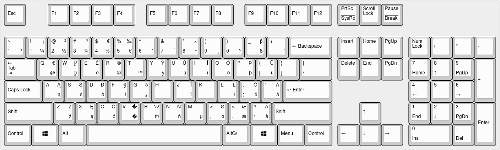
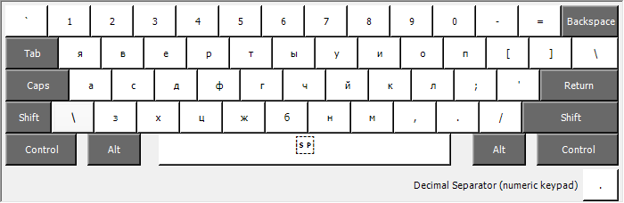
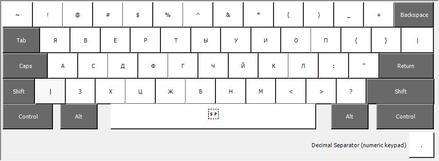
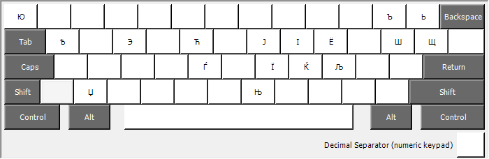

# Oliver's customized keyboard layouts

Feel free to use these in any way you want under one of the permissive (non-Copyleft) licenses approved by the OSI or CC0 terms. If unsure, simply ask.

## English extended (`kbdus_xx`) - Windows version

The Windows keyboard layout has evolved over quite some time. The (currently) final incarnation is what I call `kbdus_xx`. Whereas the `kbd` is for "keyboard", `us` refers to the fact that it's based on the "English (US)" layout and `xx` refers to the extensive
nature of the layout compared to the base version.

Now I prefer using a US-English keyboard for my typing during the daily programming and debugging chores. However, that has the downside that certain symbols are never available on any of the variants of that keyboard layout.

Fortunately Microsoft offers the so-called [Microsoft keyboard layout creator (MSKLC)](https://www.microsoft.com/en-us/download/details.aspx?id=102134) ([Guide](https://msklc-guide.github.io)), and has done so for quite some years now. This program allows to load an existing keyboard layout and adjust it to ones own needs. And so I did. The first time before Vista was even out.

Now this suits my needs, it may not suit yours. Still it could provide a basis for your own customizations or even just point you to the very fact that it's possible.

**Note:** these `.klc` files are text files. But they are UTF-16 (LE), so they may appear like binary files at first glance. The Notepad version that comes with Windows as well as any other decent text editor should be able to edit them.

Here's how the layout looks ...

(Side-note: this was created with [keyboard-layout-editor.com](http://www.keyboard-layout-editor.com/), [code on GitHub](https://github.com/ijprest/keyboard-layout-editor))

## Russian phonetic (`kbdru_us`) - Windows version

This is a kind of phonetic keyboard layout that tries to squeeze as many Cyrillic (not just Russian) characters onto a keyboard layout. Obviously for practical reasons I *had* to assign some characters in ways that are not exactly phonetic. But I tried to be pragmatic about it.

Here's how the layout looks in the various states a keyboard can have ...

### Small letters (no combination with special keys)

### Capital letters, Shift pressed

### AltGr (Ctrl+Alt), that's the one right of the space bar, pressed

### AltGr+Shift (Ctrl+Alt+Shift) pressed

