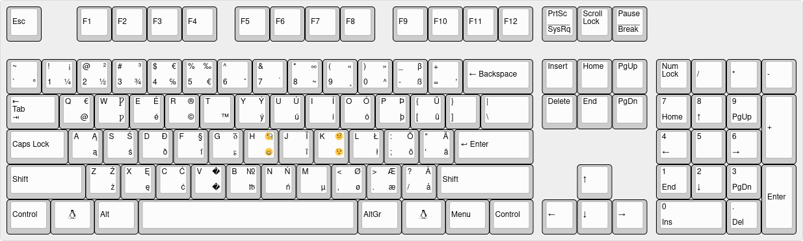

# Oliver's customized keyboard layouts (xkb version)

## xkb version (X11) of `kbdus_xx` (`us_ext`)

This one I have tested  earliest on Kubuntu 12.04 and newest on Mint 21.1. There are lots and lots of resources on how to do it on Ubuntu, but I ended up with different steps anyway in the end. Regardless, [this article](https://michal.kosmulski.org/computing/articles/custom-keyboard-layouts-xkb.html) was probably the single-most useful one in the process. Mind the fact that it has a resource section at the bottom, pointing to further useful resources.

Unlike the Windows version which is a keyboard layout in its own right, the way X11 and `xkb` work allows us to *extend* existing definitions. This is much more convenient and also allows for a more readable way of expressing this. I call it `us_ext`.



(Side-note: this was created with [keyboard-layout-editor.com](http://www.keyboard-layout-editor.com/), [code on GitHub](https://github.com/ijprest/keyboard-layout-editor))

### Installation on Kubuntu 12.04, Linux Mint 18.1 and 19 (Ubuntu 16.04 and 18.04)

Since I was unable to install the layout in the way described on the linked page, here's how to install it on Kubuntu 12.04 or Linux Mint 18.1 (and presumably Ubuntu 16.04).

Files to modify:

* `/usr/share/X11/xkb/symbols/us_ext`
* `/usr/share/X11/xkb/rules/evdev.lst` (and _optionally_ `/usr/share/X11/xkb/rules/xorg.lst`)
* `/usr/share/X11/xkb/rules/evdev.xml`

First thing is to copy the `us_ext` file from this repository into `/usr/share/X11/xkb/symbols/`. E.g. via:

    sudo cp ./us_ext /usr/share/X11/xkb/symbols/

Once that is taken care of, invoke your favorite editor (mine is Vim with tabs enabled) to edit two (or optionally three) configuration files belonging to `xkb`, so for me it was:

    sudo vim -p /usr/share/X11/xkb/rules/evdev.{lst,xml}

in the `.lst` file insert the following line:

    us_ext          English (US + DE, IS, PL, Nordic)

right under `us` in the `! layout` section. Here's a screenshot:


and in the `.xml` file insert the following block (or a sane variation thereof):

```
    <layout>
      <configItem>
        <name>us_ext</name>

        <shortDescription>en</shortDescription>
        <description>English (US + DE, IS, PL, Nordic)</description>
        <languageList>
          <iso639Id>eng</iso639Id>
        </languageList>
      </configItem>
     <variantList />
    </layout>
```

here's how that looks in Vim:


### Further actions to take

**Note:** if you replaced an older version of `us_ext` by a newer version, to reload the keyboard layout without restarting X11, run: `setxkbmap -layout us_ext`.

You may have to edit `/etc/default/keyboard` to say:

```
XKBLAYOUT=us_ext
```

... if you want it to be the default.

Additionally if you want this to take effect on the console, you may have to run `setupcon`. To have it (hopefully) take effect without reboot run `udevadm trigger --subsystem-match=input --action=change`.

Sometimes, when your keyboard layout doesn't show up you may want to use `dpkg-reconfigure xkb-data` to make your changes known.

### Choosing the layout

On (vanilla) Ubuntu I had to _first_ select "English (United States)" which brought me into a list of "variants" which included my layout as "English (US + DE, IS, PL, Nordic)".

## Miscellaneous notes

* Use `xev` to see the key codes.

## Troubleshooting

* Show current keyboard layout and involved files: `setxkbmap -print -v 10` (the `-v` is for `-verbose`)
* Show current keyboard layout: `setxkbmap -query` (way less verbose than the above)
* Show (available) layouts: `localectl list-x11-keymap-layouts`
* Show variants for a layout: `localectl list-x11-keymap-variants de`
* Show current locale (and keyboard) settings: `localectl status`

### Aliases to list various traits related to keyboard layouts

```
alias lsxkbmodels="sed '/^! model$/,/^ *$/!d;//d' /usr/share/X11/xkb/rules/base.lst"
alias lsxkblayouts="sed '/^! layout$/,/^ *$/!d;//d' /usr/share/X11/xkb/rules/base.lst"
alias lsxkbvariants="sed '/^! variant$/,/^ *$/!d;//d' /usr/share/X11/xkb/rules/base.lst"
alias lsxkboptions="sed '/^! option$/,/^ *$/!d;//d' /usr/share/X11/xkb/rules/base.lst"

alias viewxkb="less -M '+/^\s*\!\s\w+$' /usr/share/X11/xkb/rules/base.lst"
alias viewxkbmodels="lsxkbmodels | less -M"
alias viewxkblayouts="lsxkblayouts | less -M"
alias viewxkbvariants="lsxkbvariants | less -M"
alias viewxkboptions="lsxkboptions | less -M"
```

Source: [unix.stackexchange.com](https://unix.stackexchange.com/a/356782)

## Further reading

* [Custom keyboard layout definitions](https://help.ubuntu.com/community/Custom%20keyboard%20layout%20definitions)
* [XKB](https://www.x.org/wiki/XKB/) documentation on X.org
    * [The X Keyboard Extension: Protocol Specification](https://www.x.org/archive//current/doc/kbproto/xkbproto.html) (X Version 11, Release 7.7, Version 1.0)
* [An Unreliable Guide to XKB Configuration](https://www.charvolant.org/doug/xkb/)
* [Custom Keyboard in Linux/X11](https://people.uleth.ca/~daniel.odonnell/Blog/custom-keyboard-in-linuxx11)
* [Creating custom keyboard layouts for X11 using XKB](https://michal.kosmulski.org/computing/articles/custom-keyboard-layouts-xkb.html)
* [An X11 keyboard layout for scholars of old germanic](https://swanrad.ch/an-x11-keyboard-layout-for-scholars-of-old-germanic/)
* [Madduck's Extending the X keyboard map with xkb guide](https://web.archive.org/web/20170825051821/http://madduck.net:80/docs/extending-xkb/)
* [How to modify a keyboard layout in Linux](https://rlog.rgtti.com/2014/05/01/how-to-modify-a-keyboard-layout-in-linux/) and [A new nice trick for the Linux keyboard: greek letters](https://rlog.rgtti.com/2015/03/26/a-new-nice-trick-for-the-linux-keyboard-greek-letters/)
* [Keyboard layout switching](https://wiki.gentoo.org/wiki/Keyboard_layout_switching) (Gentoo Wiki)
* [Xorg/Keyboard configuration](https://wiki.archlinux.org/title/Xorg/Keyboard_configuration) (Arch Wiki)
* [damko/xkb_kinesis_advantage_dvorak_layout](https://github.com/damko/xkb_kinesis_advantage_dvorak_layout)
    * Corresponding article: [A simple, humble but comprehensive guide to XKB for Linux](https://medium.com/@damko/a-simple-humble-but-comprehensive-guide-to-xkb-for-linux-6f1ad5e13450)
* Man pages for [`xkeyboard-config`](https://man.archlinux.org/man/xkeyboard-config.7.en), [`setxkbmap`](https://man.archlinux.org/man/setxkbmap.1), [`xkbcomp`](https://man.archlinux.org/man/xkbcomp.1), [`ckbcomp`](https://www.mankier.com/1/ckbcomp)
